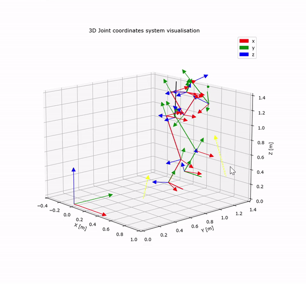
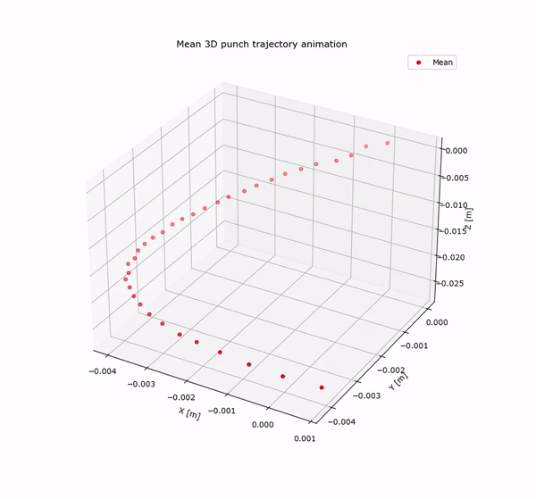
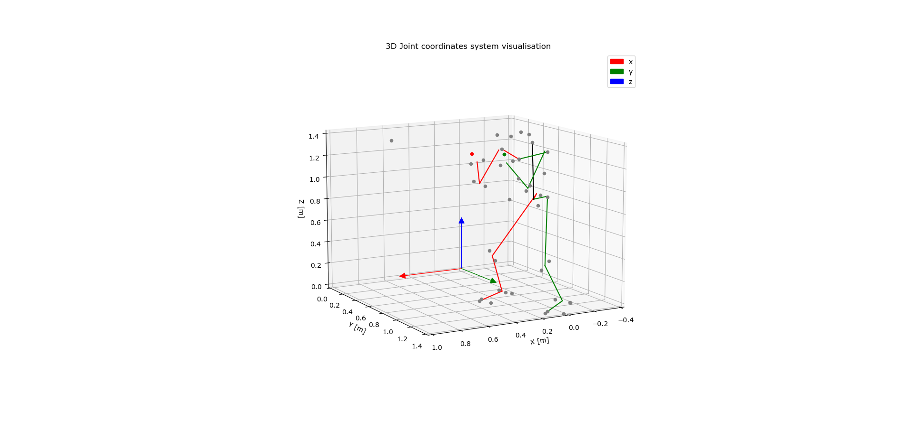
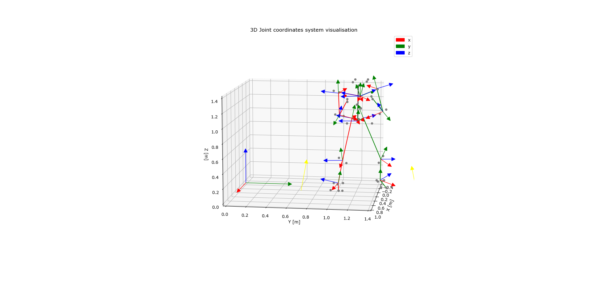
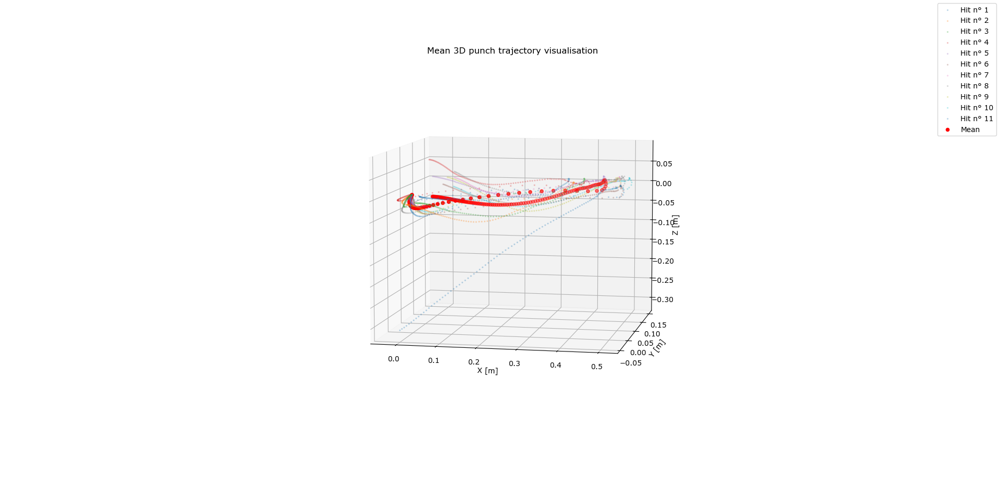

# ISB coordinate system visualisation
3D python plots to visualise International Society of Biomechanics coordinate system of a marker kinematic file (.mat file). Actually a punch example. 
## Showcase
*The returned animation of the model with coordinate system*
 

 
*The mean punch trajectory animation*
 

 
*The plot with only bones and markers (no grf, no coordinate system)*
 

*The plot with everything*
 

*The plots of all the punchs thrown and the mean punch trajectory*
 

## International Society of Biomechanics 
Tried to follow the recommandations for [upper body](https://pubmed.ncbi.nlm.nih.gov/15844264/) and [lower body](https://pubmed.ncbi.nlm.nih.gov/11934426/) from [ISB](https://isbweb.org/). The marker set used in our lab doesn't allow for exact following of the recommandations.

## Limitations 
Yet the COP GRF is not accurate. Also markers trajectory were not low pass filtered. Euler angles calculation at the end were not compared with the ones of a known model/software such as Opensim.
